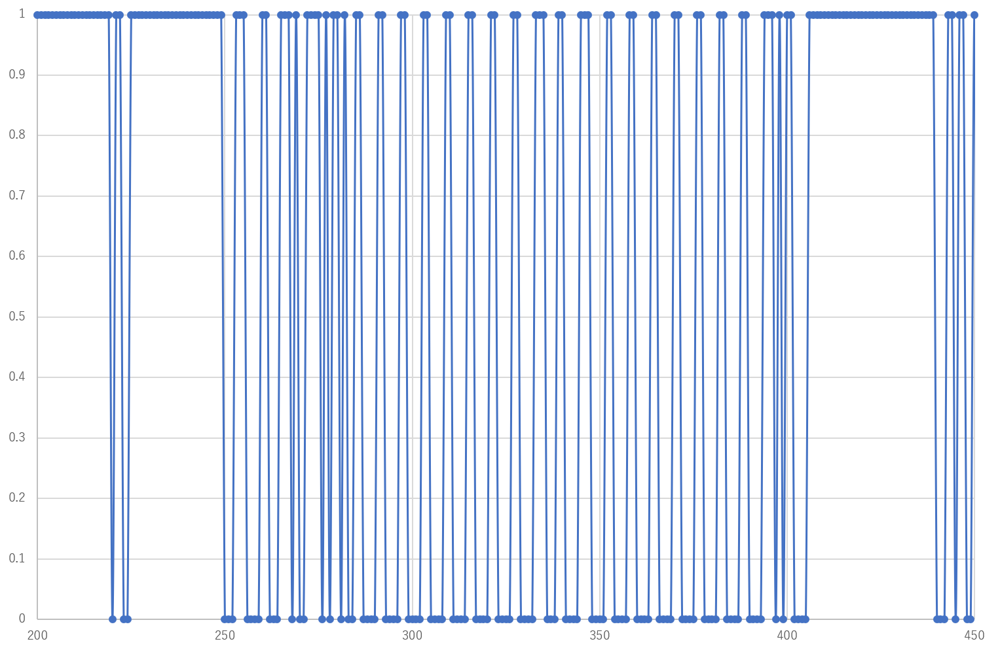

<!-- $size: 16:9 -->

  

    <c style="color: midnightblue;">
   		自分の部屋を快適にしよう！
    </c>
  

<!-- *footer : はるゆき @haruyuki_16278 -->

-------------------------

# とりあえず自己紹介でもしとく？ 

+ 	名前：はるゆき
+	Twitter : @haruyuki_16278

めんどくなったのであとは当日の俺が喋ってくれます．

-------------------------

# 今日話す内容

デバイス系の話をしようと思っていましたが
ちょっとむずかしい通信系の話も入ってきそう

「デバイス苦手だなあ」とか「なんのはなししてるかわからん」
という方は香川県のうどんについて考えていてください．

-------------------------

# 今までの経過

+ 	お部屋魔改造か... → とりあえずリモコンからやるか
	→リモコンの信号解析 (技術書典6 #kosen16s本を呼んでね！)
+	.....

	 ↑ 今ここ
    
-------------------------

# 今までの経過

+ 	お部屋魔改造か... → とりあえずリモコンからやるか
	→リモコンの信号解析 (技術書典6 #kosen16s本を呼んでね！)
+	.....

	## ↑ 今ここ
    
-------------------------

# 今までの経過

+ 	お部屋魔改造か... → とりあえずリモコンからやるか
	→リモコンの信号解析 (技術書典6 #kosen16s本を読んでね！)
+	.....

  

　  ↑ 今ここ 
  

-------------------------

  いや， 
  なんもしとらんや～～～～～～～～～～～～～～～ん

-------------------------

# やりましょう！

と思った矢先のこと...
## 「あ，解析用デバイスの使い方忘れた」

-------------------------

# 他にもやることはある！

これまで何も調べずに，
ただ魔改造したいと思ってリモコンの信号を
取得・解析してきましたが，

### 通信フォーマットとか考えたことなくね！？
## →調べましょう！

-------------------------

# というかまず通信フォーマットって何？

-------------------------

# 赤外線リモコンの通信フォーマット

このキーワードでgoogle先生に調べ物を頼むと

+ 	赤外線リモコンの通信フォーマット - ELM by ChaN
	http://elm-chan.org/docs/ir_format.html
+	赤外線リモコンのフォーマット
	http://www.asahi-net.or.jp/~gt3n-tnk/IR_TX1.html
+	エアコンのリモコン信号を解析する ~デコード編~ - Qiita
	https://qiita.com/gorohash/items/598d69a63bd6b4308291

と言った記事を教えてくれます．
しっかりした解説を読みたいという方はこちらの記事を読んでください．

-------------------------

  

  	で
   

-------------------------

## ざっくり説明すると，

+ 	**赤外線リモコンの通信フォーマットは**(大きく)**3種類**
	（海外規格も普及しつつあるので要注意）
+ 	リモコンで使用する赤外線の波長は**950[nm]**
+ 	一回の信号あたりの信号が出力されている時間は**108[ms]**
+ 	とりあえず**リーダー**とよばれる信号を取れれば**規格がわかりそう**

-------------------------

## 自分がとったデータでリーダーを確認してみる

-------------------------

-------------------------

  

  	...?
   

-------------------------

-------------------------

-------------------------

ちょっとこのデータと合う通信規格が見つからない....
# →もしかしてデータちゃんと取れてないんじゃない？

-------------------------

# 反省

+	データがいつ取れたものなのかが全くわからない
	(信号が出力されてから何[ms]経っているのかがわからない)
+   Arduino の digitalRead() 関数は処理にかかる時間が長い
	(知ってたけどとりあえずで作ってそのまま放置していた)
    
-------------------------

# 信号なんて簡単に取れるだろ とタカをくくっていた

-------------------------

# まとめ

自分が作ったデバイスでは信号を取り切れていませんでした......
とりあえず，赤外線リモコンの通信フォーマットについて知ることはできました．

次回，デバイス改良編でお会いしましょう．
