# リモコンの信号解析してみる
<div style="text-align: right;">
<br>
書き手 : @haruyuki_16278
</div>

## あぶすとらくと
はじめまして，はるゆきと申します．<br>
今回，#kosen16sというコミュニティで合同本を出すということで，私も記事を一つ書かせていただくことになりました．しかし，部活に精をだしすぎたり変に意識高くなって漢検受けようとしたりした結果，今この冒頭部分を締切日の午後9時に書いています...(ToT) ．果たしてこの記事を書き上げることができるのでしょうか！？<br>

閑話休題(漢検の勉強中に意味を知ったので使いたがっている．)<br>
さて，この話ですが，始まりはある日「自室魔改造したいな」と思ったことに始まります．<br>
「ベッド入ったら勝手に電気消えるようにできたら，毎日かあさんに『電気消して寝なさい！』って叱られなくていいのにな．」<br>
みたいなしょうもないところから発展して<br>
「とりあえずリモコンから送られてる信号がわからないと話になんねえな！」ということで今に至ります．<br>

ここではリモコンから送信されている信号をExcel上でグラフにして観察することをゴールとします．<br>
情報系ガチ勢っていう人も電子工作大好きって人も，それなりに「ほーん」と言っていただけるような記事になる予定ですので，このあともよろしくお願いします！<br>

## まずは
やらなきゃいけないことを順序立てて考えていきます．<br>
<br>
リモコンから送られてくる信号を割り出すためには，まずなんとかしてリモコンからの信号を取ってこなければいけません．そのためにはリモコンからの信号を取れる(受信できる)何かが必要ですね．<br>
世の中の大抵のリモコンは赤外線を飛ばして本体と通信します．なので赤外線を受け取れる素子を使えばいいわけです．赤外線を受け取ることができる素子はいろいろありますが，ここではフォトトランジスタを使ってみることにします．<br>
フォトトランジスタは自分の周りの光の強さに合わせて出力される電圧の大きさが変化する素子です．この電圧の変化をArduinoで読み取ってシリアル通信を使ってパソコンに送りましょう．その後はExcel+VBAマクロを使って送られたデータをシートに入力，グラフにして観察することにします．<br>
これが大まかな流れです．整理して図にまとめてみましょう．<br>

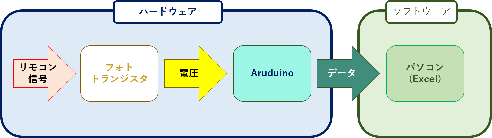<br>
大きくハードウェアとソフトウェアに分類してみました．  
それでは，ハードウェアから始めていきましょう！

## ハードウェア
### リモコン信号の受信
さて，それでは最初にリモコン信号を受け取って電圧として信号を出力してくれるデバイスを作りましょう．<br>
そのために，NJL7112Bというフォトトランジスタを使います．<br>

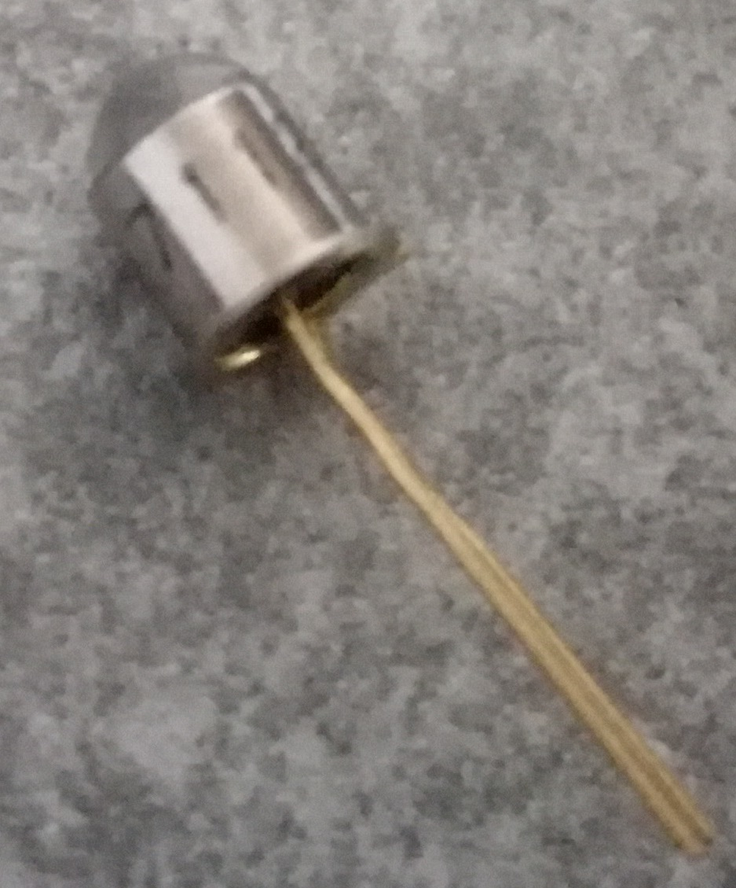このフォトトランジスタは赤外光によく反応する性質を持つので，今回の用途には最適です．この素子を使って，周りの明るさに合わせて光の強さが変わるLEDを作ってみましょう．<br clear="all">

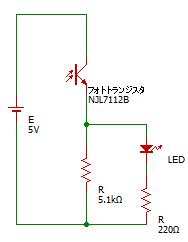
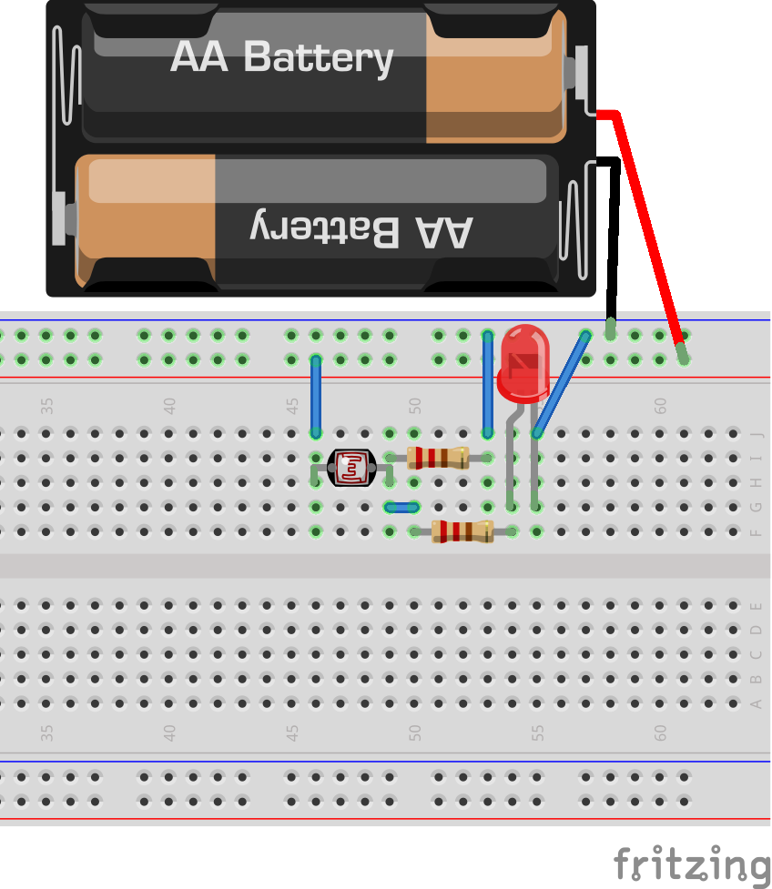<br clear="all">
左にブレッドボード上での回路，右にフォトトランジスタを使ってLEDの明るさを制御する回路を示します．<br>
ブレッドボード上の回路の方では，フォトトランジスタを直接表現できないため，同じく光を感じる素子であるCdSセルで代用しています．
周りの光が強くなればLEDの光も強くなり，周りの光が弱くなればLEDの光も弱くなる回路になっています．<br>
下の二枚の写真を見てください．<br>
左側の写真では画像中央部のフォトトランジスタが見えていて，LEDが赤く光っています．右側の写真のようにフォトとランジスを指でつまでみると，周りが暗くなって光らなくなっていますね．<br clear="all">
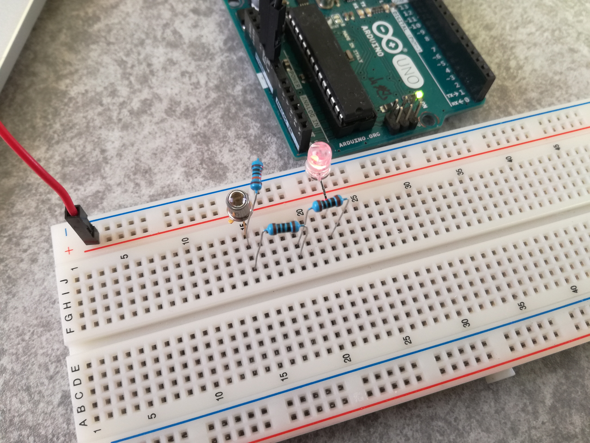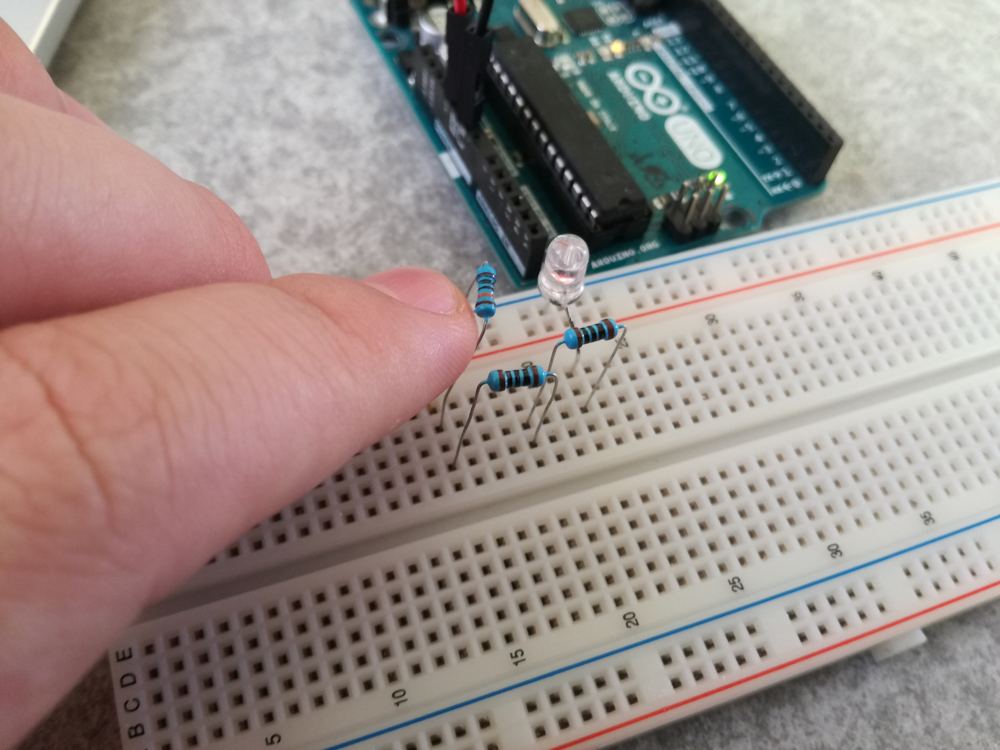<br><br>
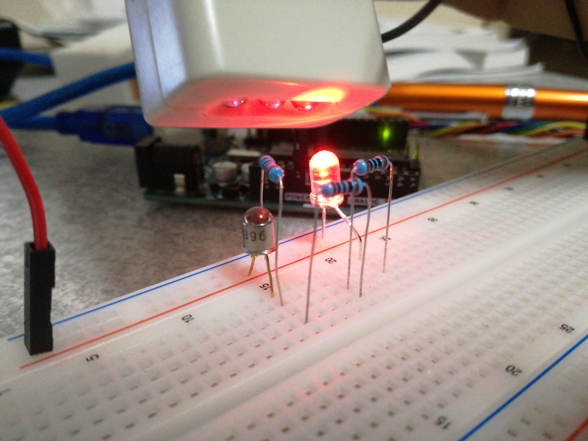
この回路のフォトトランジスタにリモコンを向けて，ボタンを押してみるとどうでしょうか？<br>
「ピカピカッ」とすばやく光ったと思います．これがリモコンから送られている信号です．<br>
この信号をArduinoを使って読み取ることにしましょう．<br clear="all">

### 信号の記憶・送信
これまでにも何度か文中に出てきているArduinoですが，「何じゃそれ」という方のために簡単に説明しましょう！<br>
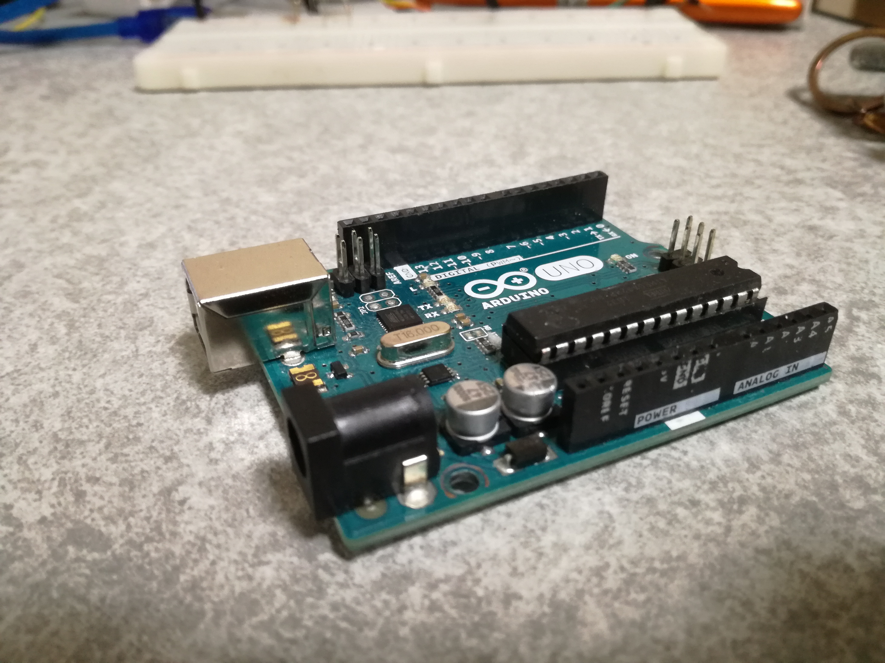
左の写真に写っている青緑色が特徴のボードがArduinoです．
>**Arduino（アルデュイーノ もしくは アルドゥイーノ）とは、AVRマイコン、入出力ポートを備えた基板、C言語風のArduino言語とそれの統合開発環境から構成されるシステム。** <br>
>**スタンドアローン型のインタラクティブデバイス開発だけでなく、ホストコンピュータ上のソフトウェア（例えば、Adobe Flash、Processing、Max/MSP、Pure Data、SuperCollider）で制御することもできるワンボードマイコンの一種。**
wikipedia(https://ja.wikipedia.org/wiki/Arduino)より引用<br clear="all">

つまるところ，Arduinoを使うと，プログラミングを使って回路を動かすことができるんです！<br>
では， Arduinoを活用してフォトトランジスタで受け取ったリモコンの信号を読みとってみましょう．<br>
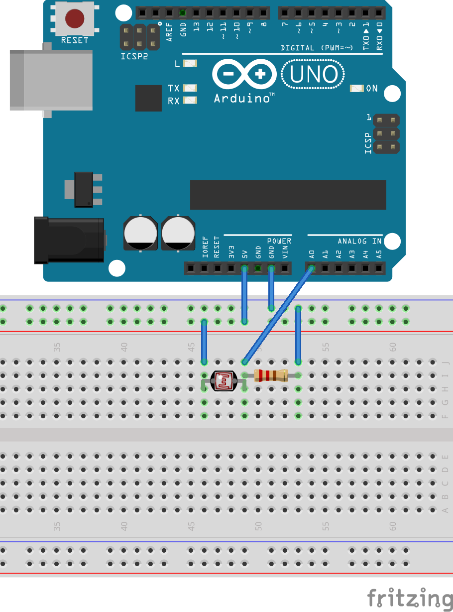<br>
ここでもフォトトランジスタはCdSセルで代用しています．以下もブレッドボードの実配線図では代用しますのでご了承ください．<br>
さて，図ではArduinoのA0ポートに先程LEDをつなげていた部分から配線されていますね．
これで，LEDに送られていた信号がArduinoに送られるわけです．<br>
では，Arduino側で，A0ポートの値を読み出すプログラムを作りましょう．<br clear="all">
<br>
そのために，右図の「Arduino IDE」というソフトを使います．<br>
>Download the Arduino IDE https://www.arduino.cc/en/main/software より<br>

Arduino言語のプログラミング，コンパイルからアップロード，シリアル通信のモニタまで，Arduinoに必要なすべてが詰まった統合開発環境です．<br>
このソフトに以下のコードを入力してコンパイル，Arduinoにアップロードします.<br>

```Arduino:List1.ino
Setup(){
    Serial.begin(9600);
}

Loop(){
    Serial.println(analogRead(0));
}
```

<br clear="all">
シリアルモニタを起動して見ると下の画像のようにArduinoから送信されてきたA0ポートの電圧値が表示されています．
<br>
では再びフォトトランジスタにリモコンを向けてボタンを押してみるとどうでしょうか？<br>
<br>
おおおおおお！！！<br>
しっかり反応していますね．<br>
この画像の中では800~1000台の値が出ているときがLEDとつないでいたときLEDが光ったときの値になります．<br>
しかし，これでは永遠に流れてくるデータの中から信号を検知しているぶうぶんを探さなければならない上に，どこが始まりなのかもよくわかりませんね...<br clear="all">

### デバイス化
そこで，ここまでの2つの小節でやったことを合わせて，こんなものを作ってみました！
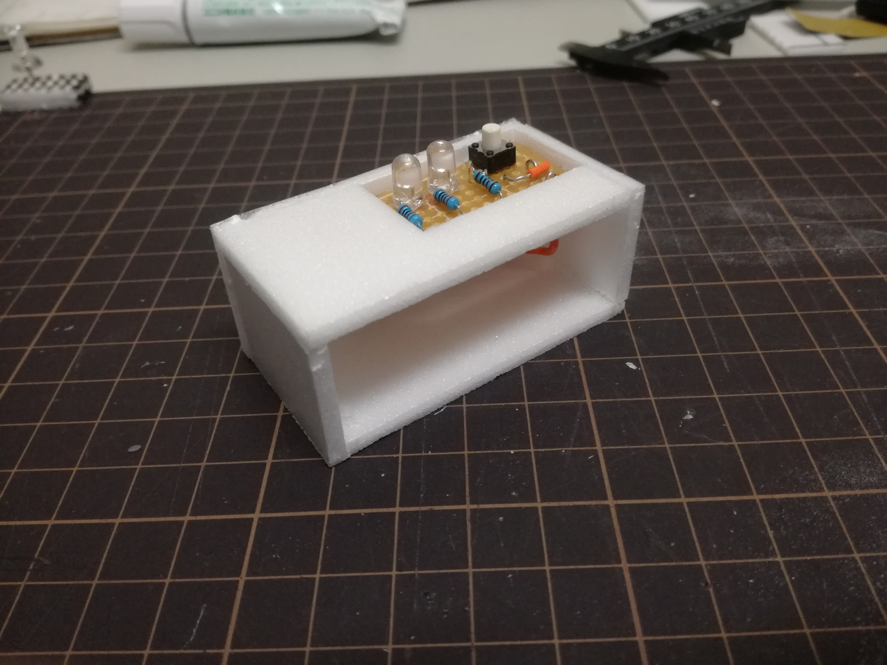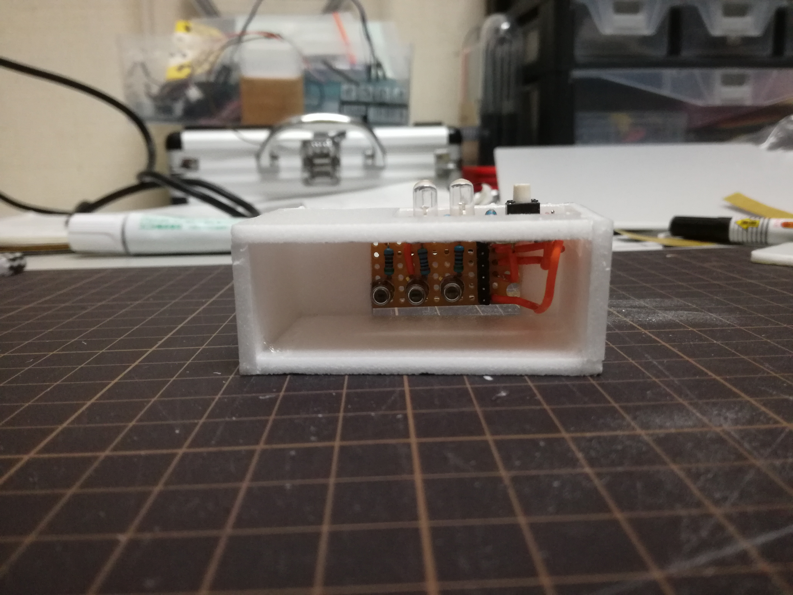<br>
スチレンボードとユニバーサル基板を使ってリモコンの信号を簡単に取れるように箱型のデバイスにしました．<br>
残念ながら配線を間違えて常に1000近くの値が出力され，信号を拾ったときに値が20~100くらいに下がるようになってしまいましたが，信号は拾えているので良しとしましょう．<br>
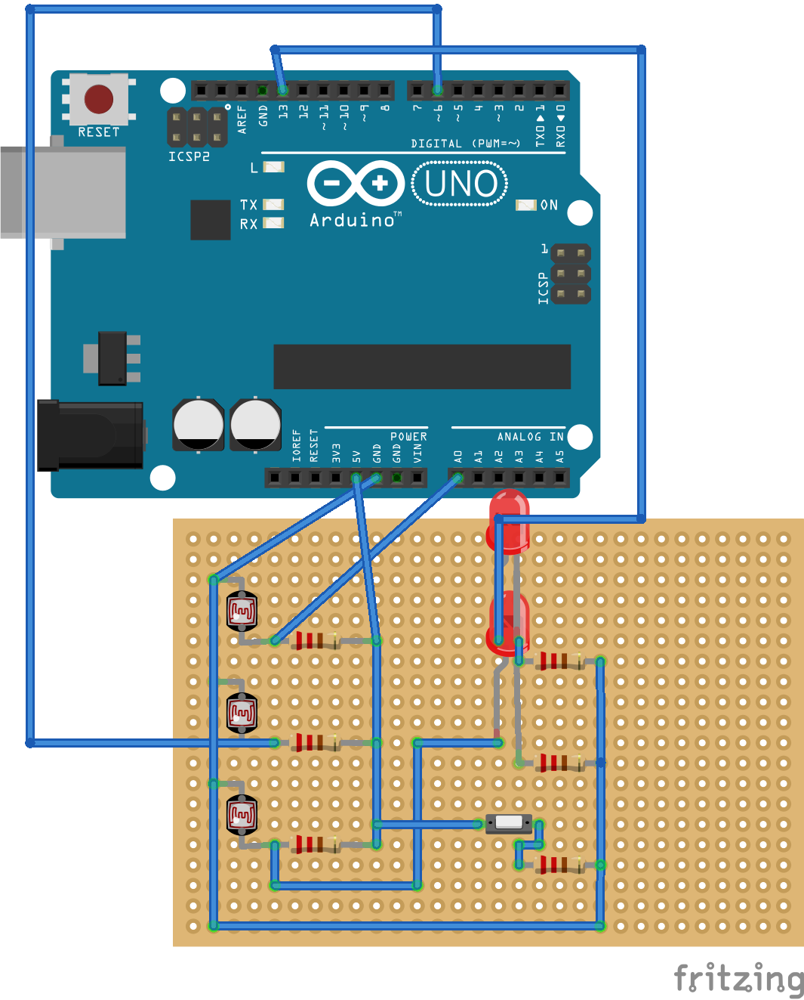<br>
デバイス内部の回路は右図のように配線されています．<br>
デジタル入力とアナログ入力の両方を使うことができ，また，最初に作ったフォトトランジスタの値で光の大きさが変わるLEDを装備しています．<br>
また，もう一つのLEDはデジタルの13ポートに繋がっており，これはプログラムを実行したときのパイロットランプとして使うために新たに取り付けました．タクトスイッチも同様に，プログラムで追加した機能を使うために取り付けたものです．<br>
それでは，ソースコードを見てみましょう．<br clear="all">

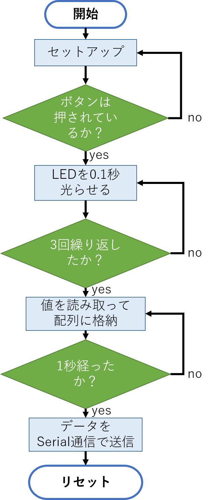

```Arduino:Signal_Recorder.ino
// リモコン信号受信用デバイス
// 18,47行目のコメントアウトはシリアルモニタでデータを見るときは
// 外したほうがいいかも

#define data_num 1000

void cdown(unsigned int times);
void send_data(boolean, int);
unsigned int i,t;
boolean digital_data[data_num] = {0};

void setup() {
  t = millis();
  digitalWrite(13,HIGH);
  Serial.begin(9600);
  pinMode(2,INPUT);
  pinMode(4,INPUT);
  pinMode(13,OUTPUT);
//  Serial.println("standingby...");
  while(millis() < t+1000){}
  digitalWrite(13,LOW);
}

void loop() {
  while(digitalRead(2)){
    cdown(3);
    t = millis();
    digitalWrite(13,HIGH);
    i=0;
    while(millis() < t + 1000){
      digital_data[i] = digitalRead(4);
      delay(1);
      i++;
    }
    digitalWrite(13,LOW);
    for(i = 0; i < data_num; i++){
      send_data(digital_data[i]);
    }
    Serial.flush();
    pinMode(12,OUTPUT);
  }
}

void cdown(unsigned int times){
  for(i = 0;i < times;i++){
    t = millis();
    digitalWrite(13,HIGH);
//    Serial.println(3-i);
    while(millis() < t+100){}
    digitalWrite(13,LOW);
//		Serial.println("LOW");
    while(millis() < t+500){}
  }
}

void send_data(boolean d_data){
  Serial.println(d_data);
  delay(10);
}
```

と，このようなコードになっています．右側にこのプログラムをまとめたフローチャートを示します．これでさっきのLEDとタクトスイッチの役割がわかりましたね．<br>
ではこのプログラムの実行結果をシリアルモニタで確認してみましょう．<br>
<br>
このように，シリアルモニタに「standingby...,3,2,1,…」と表示されています．その後送信されてくるデータがフォトトランジスタで取得した赤外線のデータです．(デジタルポートのデータを読み出しているので，赤外線を検知すれば0,していないときは1が出力されます．)<br>
右側の画像が実際に赤外線を検知している画面です．<br><br>
これでハードウェアは完成です！<br>
次は，このデータをExcelマクロを活用してグラフに起こしてみましょう．<br clear="all">

##  ソフトウェア
### マクロの作りかた
Excelのマクロを作る方法には大きく2つが挙げられます．<br>
まず，Excelの機能を使って自分の操作を記録する方法です．この方法は，マウスとキーボード等で行った簡単な操作を記録できるもので，繰り返しや条件処理など，複雑な処理を行うことはできません．<br>
次に，VBAというマクロを記述できるプログラミング言語を直接使用する方法です．<br>
VBAとは，Visual Basic for Applicationsの略で，Visual Basicをソフトウェアの記述のために改良した言語のことです．<br>
では，VBAの記述を始める前に，マクロの開発を簡単にする便利な機能をご紹介しましょう．<br>
次の手順に沿って操作することで，ツールバー上に「開発」タブという，マクロ開発に特化したツールバーを表示させることができます．<br>

1. Excelを起動し，空白のブックを開く．
2. ファイルタブを開く．
3. オプション設定を開く．
4. リボンのユーザー設定タブを開く．
5. 開発の左のチェックボックスにチェックを入れる．
6. 空白のブック画面に「開発」タブが表示される．

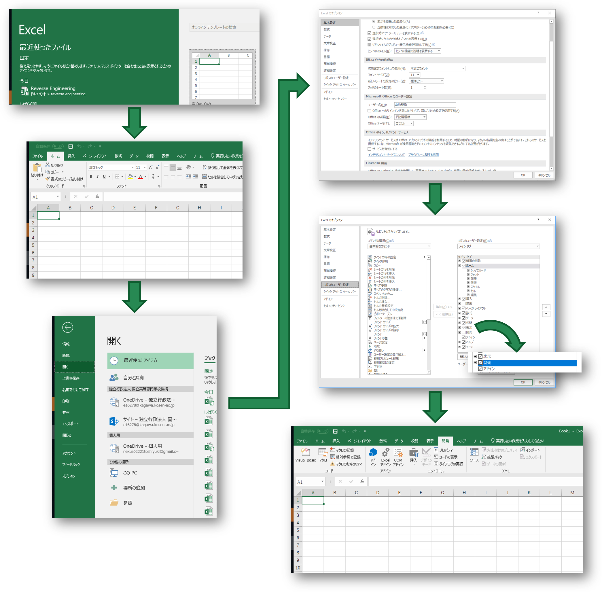<br>
これで，「開発」タブを表示することができたでしょう．では，Visual Basicと書いてある左上のボタンをクリックして，エディタを起動しましょう．<br>
<br>
このようなエディタが立ち上がったでしょうか？<br>
ではさっそく，プログラムを書いていきましょう！<br>
プログラムを記述するために，右側に表示されているプロジェクトウィンドウを右クリックして挿入→標準モジュールを選択して，モジュールを挿入します．<br claer="all"><br>

<br>
画面の背景が白くなったらプログラムを入力できます．次のコードを入力してみましょう．<br>

```VB:hello_world.bas
Sub HelloWorld()
    Range("B2").Value = "Hello, World"
End Sub
```
このマクロを実行してみましょう．一旦エディタを閉じます．<br clear="all">

<br>
開発タブの右上にあるマクロボタンを押して右側のようなマクロを実行できるウィンドウを表示します．<br>
先程作成したHelloWorldを選択して実行をクリックします．<br clear="all">


右の画像のようにB2セルに「Hello,World!」と入力されていれば成功です．<br>
このように，VBAを直接記述してマクロを作成することができます．この方法であれば，繰り返し処理や条件分岐処理をマクロとしてじっこうすることが可能になります．<br>
では，この方法を使って，Arduinoから送られてくる信号を表に記録するマクロを作りましょう．<br clear="all">

### シリアル通信からのデータの受け取り
Arduinoからのデータの送信にはSerialいうモジュールを使いました．<br>
このデータを受け取るためには，COMポートというものからデータを読み取らなければなりません．<br>
残念ながら私にはそんな技術力はないので，先人たちが残してくれたモジュールを使います．<br>
それが，「EasyComm」モジュールです！(製作者ページ？：http://www.activecell.jp)<br>
このモジュールは，ExcelマクロでCOMポートを扱えるようにする拡張モジュールで，このモジュールの中の関数を用いることでArduinoからのデータを表に記録することができます．<br>
では，実装用のコードを見ていきましょう．<br>

```VB:COM_logger.bas
Attribute VB_Name = "Module11"
Sub COMlogger()

Dim A As String
Dim i As Integer

'初期設定
ec.COMn = 3 'COM3を指定
ec.Setting = "9600,n,8,2" '通信条件(ボーレート，パリティビット数，データビット数，ストップビット数)の設定
ec.HandShaking = ec.HANDSHAKEs.RTSCTS '通信ハンドシェークの設定
ec.Delimiter = ec.DELIMs.CrLf 'データの区切りを示す文字列を設定

'データ処理準備
Worksheets.Add

'データの受信と処理
For i = 1 To 1000
    A = ec.AsciiLine
    ec.InBufferClear
    Cells(i + 2, "B").Value = i
    Cells(i + 2, "C").Value = Val(A)
Next i

'終了処理
ec.COMn = -1 'ポート開放

End Sub
```

これを実行することでArduinoからデータを受け取り，表に記録することができます．
実行結果を下図に示します．<br>

赤外線を検知したときの値の変化も記録されていますし，しっかり1000個目までデータを記録できています．<br>
これで，このデータをもとにグラフを作成することで，リモコンから送信されているデータを分析できます．